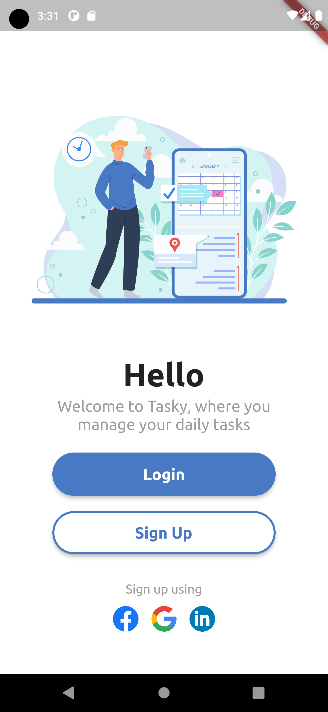

# login_app

SignUp and Login using this app with its simple and stunning UI

## Output

### What i used

packages: Material, Firebase auth, Loading overlay, rFlutter alert

assets: images represeting the heading for each app page and one font to style the text
